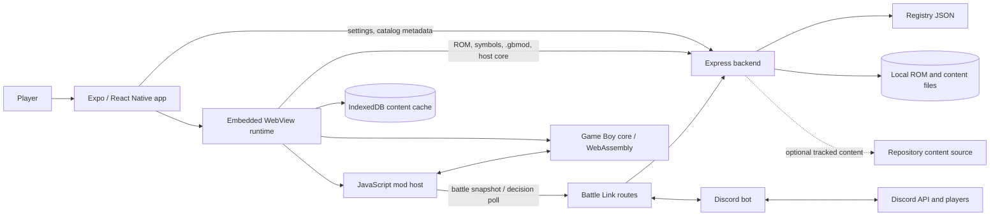

# Architecture and data flow

Pokeboy separates the native application shell, browser-hosted emulator, C++
core, catalog backend, and optional Battle Link integration. The Expo app and
the WebView both call the same configured backend.

## Content lifecycle

`backend/data/registry.json` names cartridges, mods, the host core, and their
versions. The backend adds checksums for the bytes it can currently serve. ROM
bytes always come from the backend's local ROM directory; they are not tracked.

In the default `CONTENT_SOURCE=local` mode, registry, symbols, mod packages, and
host core also come from local paths. `CONTENT_SOURCE=github` asks a trusted
backend to fetch those tracked items from `CONTENT_BASE_URL`, optionally with a
server-only `GITHUB_TOKEN`, and falls back to local files on failure. This mode
does not make ROMs remote and must never expose the repository token to the app.

The WebView caches ROM and mod payloads using registry versions. The host core
is JavaScript implementing mod imports; `.gbmod` packages and symbols are handed
to the C++ mod runtime through the WebAssembly adapter. The native shell retains
settings, selected mods, saves, and the installed-version manifest.

The Settings **Pull latest** action compares and refreshes the installed ROM and
mod manifest. It does not replace the app binary. UI, native configuration, and
bundled emulator changes require a newly built and sideloaded IPA.

## Battle Link

Battle Link is a mod-to-host protocol. The host core submits battle state and
waits for a legal action. The backend can expose that decision path through its
public Battle Link console and, when configured with a bot token, Discord. The
Discord gateway and REST traffic remain on the backend; device API keys and bot
tokens serve different purposes and should not be exchanged.
