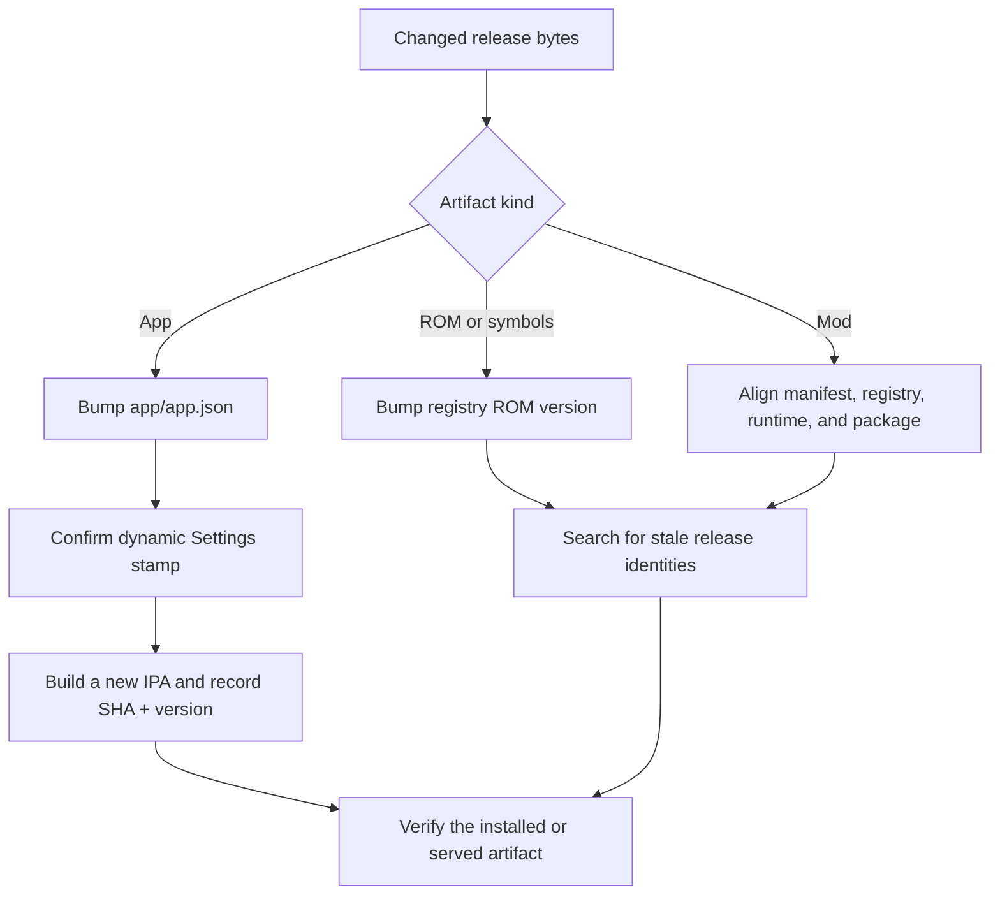

# Builds, releases, and versions

Every installed or cached artifact must be identifiable without relying on a
filename or on when it was downloaded.

## App identity

`app/app.json` at `expo.version` is the only app build version. The package
versions in `package.json` files are dependency-project metadata, not installed
Pokeboy identity. Settings reads the Expo value through `expo-constants` and
shows `BUILD vX.Y.Z`; keep that stamp visible and dynamic.

Every change under `app/` needs a new, previously unused app version in the same
change:

- use a patch bump for a JS, style, image, or audio fix that an existing native
  binary can safely run;
- use a minor bump for a feature, native dependency or plugin change, prebuild
  configuration change, native module change, WebAssembly/adapter ABI change,
  or changed bundled emulator core.

Generated iOS and Android project versions come from `app/app.json`. Never bump
an `Info.plist`, Xcode marketing version, or Gradle `versionName` directly.

## Unsigned iOS artifact

The unsigned IPA is produced by the manually dispatched **iOS build (unsigned)**
workflow and uploaded as `pokeboy-ios-unsigned`:

```sh
gh workflow run ios-build.yml --ref <branch>
```

A merge does not prove an IPA exists, and the latest workflow timestamp does not
prove it contains the latest code. Record both the workflow source commit SHA
and the `expo.version` embedded in the artifact. A feature branch can be built
directly; it does not need to land on the release branch merely to obtain a test
artifact.

When on-device behavior is missing, compare the Settings build stamp with
`app/app.json` at the workflow's exact source SHA. If they differ, sideload the
matching newer artifact before debugging code. Settings **Pull latest**, Metro
refresh, and cache clearing cannot update an IPA or its bundled emulator assets.

## ROM and mod cache identity

The registry version participates in client cache keys. Changed bytes under an
old version can leave a device running stale content.

For a ROM byte or deployed symbol change, bump the matching `roms[].version` in
`backend/data/registry.json`. Symbols are cached with their cartridge version.

For a mod release, use one version in all of these places:

1. `gameboy/mods/<mod>.mod.json` at `metadata.version`;
2. the matching `mods[]` entry in `backend/data/registry.json`;
3. the host runtime identity bundled in `app/assets/emulator/mod-core.bin`, such
   as `mod: "battle-link@X.Y.Z"`;
4. the rebuilt `.gbmod` package metadata deployed under `backend/mods/`.

Manifest, assembly, payload, patch, relocation, import, host behavior,
permission, or configuration changes all require a new mod version and rebuilt
package. The host core has its own `host.version` registry identity and must be
bumped when its served bytes change.

## Pre-release checks



Immediately before integrating an app change, compare against current
`origin/dev`, allocate a number higher than all app versions already merged
there, and search relevant paths for the previous release identity. Parallel
branches do not reserve version numbers; reallocate if another change lands
first.
